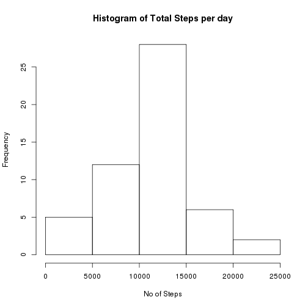
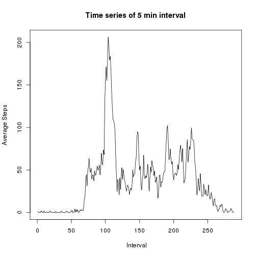
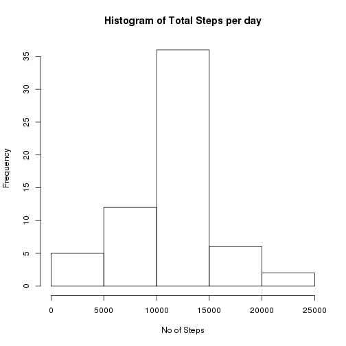
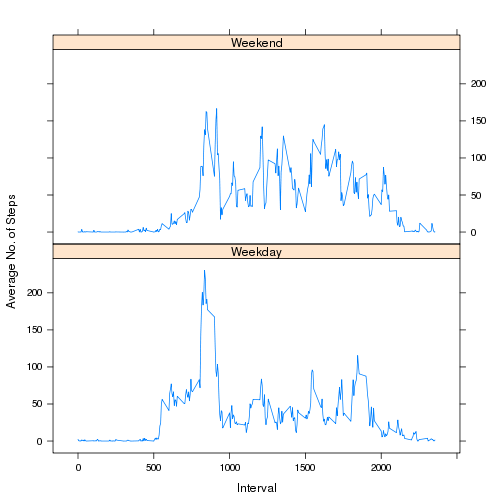

# Reproducible Research - Peer Assignment 1
  
## Loading and preprocessing the data


```r
rawData <- read.csv("activity.csv", header=TRUE)
```

## What is mean total number of steps taken per day?


### Ignore the missing values in the dataset

```r
stepsData <- subset(rawData, complete.cases(rawData)== TRUE)
```

### Calculate total number of steps taken per day

```r
stepsPerDay <- aggregate(stepsData$steps,list(stepsData$date),sum)
colnames(stepsPerDay) <- c("Date","Total_Steps")
```

### Histogram of the total number of steps taken each day

```r
hist(stepsPerDay$Total_Steps, main = "Histogram of Total Steps per day", xlab = "No of Steps")
```

 

### The mean and median of the total number of steps taken per day

```r
avgSteps <- mean(stepsPerDay$Total_Steps)
medianSteps <- median(stepsPerDay$Total_Steps)
cat("Mean is: ", avgSteps)
```

```
## Mean is:  10766.19
```

```r
cat("Median is: ", medianSteps)
```

```
## Median is:  10765
```


## Average daily activity pattern
###Time series plot of the 5-minute interval (x-axis) and the average number of steps taken, averaged across all days (y-axis)

```r
stepsPerInterval <- aggregate(stepsData$steps,list(stepsData$interval),mean)
colnames(stepsPerInterval) <- c("Interval","Average_Steps")
plot(Average_Steps ~ c(1:nrow(stepsPerInterval)), stepsPerInterval, type ="l", xlab = " Interval", ylab = "Average Steps", main = "Time series of 5 min interval")
```

 

###The 5-minute interval which contains the maximum number of steps (on average across all the days in the dataset) 

```r
which.max(stepsPerInterval$Average_Steps) 
```

```
## [1] 104
```

## Imputing missing values

### Total number of missing values in the dataset

```r
naData <- subset(rawData, complete.cases(rawData)== FALSE)
nrow(naData)
```

```
## [1] 2304
```

### Strategy for filling in all of the missing values in the dataset:  Get the mean for that particular 5-minute interval and fill the missing value with it

```r
completeData <- subset(rawData, complete.cases(rawData)== TRUE)
for(i in 1:nrow(naData)) {
  naInterval <- naData[i,3]
	meanForInterval <- round(mean(subset(completeData$steps, completeData$interval == naInterval)),0)
	naData[i,1] <- meanForInterval
}
```

### Create new dataset that is equal to the original dataset but with the missing data filled in

```r
processedData <- rbind(naData, completeData)
processedData <- processedData[with(processedData, order(date,interval)),]
```

### New histogram of the total number of steps taken each day (without missing values)

```r
stepsPerDayNew <- aggregate(processedData$steps,list(processedData$date),sum)
colnames(stepsPerDayNew) <- c("Date","Total_Steps")
hist(stepsPerDayNew$Total_Steps, main = "Histogram of Total Steps per day", xlab = "No of Steps")
```

 

### The new mean and median of the total number of steps taken per day

```r
avgStepsNew <- mean(stepsPerDayNew$Total_Steps)
medianStepsNew <- median(stepsPerDayNew$Total_Steps)
cat("New Mean is: ", avgStepsNew)
```

```
## New Mean is:  10765.64
```

```r
cat("New Median is: ", medianStepsNew)
```

```
## New Median is:  10762
```

### Difference in reading of old and new values of Mean and Median

```r
cat("Old mean is :", avgSteps, " New mean is :", avgStepsNew )
```

```
## Old mean is : 10766.19  New mean is : 10765.64
```

```r
cat("Old median is :", medianSteps, " New median is :", medianStepsNew )
```

```
## Old median is : 10765  New median is : 10762
```


## Differences in activity patterns between weekdays and weekends

### New factor variable in the dataset with two levels - "weekday" and "weekend" indicating whether a given date is a weekday or weekend day

```r
weekDayType <- as.matrix(1:nrow(processedData),1)
processedData$date <- as.Date( processedData$date, format = "%Y-%m-%d")
for(i in 1:nrow(processedData)) {
  if ( weekdays(processedData[i,]$date) == "Saturday" | weekdays(processedData[i,]$date) == "Sunday")	{
		weekDayType[i,1] <- "Weekend"
	}
	else	{
		weekDayType[i,1] <- "Weekday"
	}
}
combinedData <- cbind(processedData,weekDayType)
avgStepsPerInterval <- aggregate(combinedData$steps ~ combinedData$interval + combinedData$weekDayType,combinedData,mean)
colnames(avgStepsPerInterval) = c("interval","weekDayType","Avg_Steps")
```

### Panel plot containing a time series plot of the 5-minute interval (x-axis) and the average number of steps taken, averaged across all weekday days or weekend days (y-axis). 


```r
library(lattice)
xyplot(Avg_Steps ~ interval | weekDayType, data=avgStepsPerInterval, type = "l", layout= c(1,2), xlab = "Interval", ylab="Average No. of Steps")
```

 


